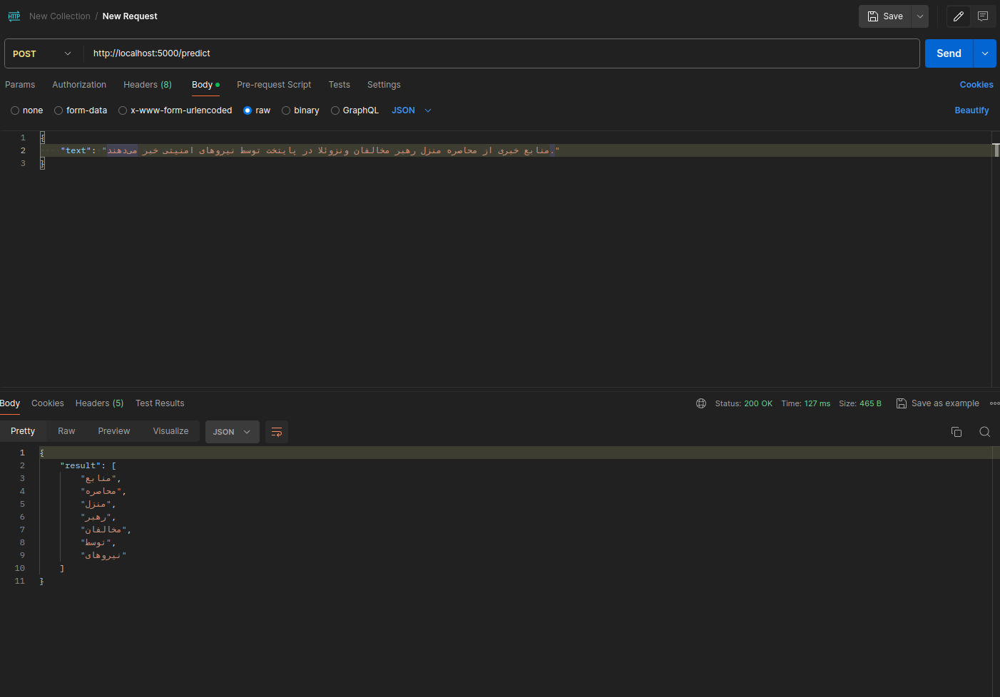

# persian_kasre_ezafe

## Dataset

## Train

1. Train bert on 50000 raw preprocessed data which has labeled by Pos tagger Hazm library (inaccurate labels)
2. Fine-tune the trained model of step1 on 1000 clean data wich has lebeled by human (accurate)

`https://github.com/mahsazamani/persian_kasre_ezafe/blob/main/train_codes/bert_train.ipynb`

## Test

`https://github.com/mahsazamani/persian_kasre_ezafe/blob/main/test.py`

## Build Image and Send request:

Building image of the project from the given Dockerfile:

`sudo docker build -t ImageName:Tag .`

Run the the image after building to run the app.py:

`sudo docker run -it -p 5000:5000 ImageName:Tag`

Sending Request:

- with curl: `curl -X POST http://127.0.0.1:5000/predict -H "Content-Type: application/json" -d '{"text": "من امشب زندگی رو خیلی زیبا و جنجالی میبینم. چون فوتبال بارسلونا قراره پخش بشه"}'
`
- with postman:

